

## Laravel APIs Documentation

### HEADERS REQUIRED

 Make sure your request has following headers: 

###### 'Accept' : 'application/json'
###### 'Authorization' : 'Bearer Token'
------------------------------------------------------------------------------------------

### API URLs

###### POST | REGISTER USER
https://image-hosting-sharing-service.herokuapp.com/api/register

###### POST | LOGIN USER
https://image-hosting-sharing-service.herokuapp.com/api/login

###### POST | LOGOUT USER
https://image-hosting-sharing-service.herokuapp.com/api/logout

###### POST | FORGOT PASSWORD
https://image-hosting-sharing-service.herokuapp.com/api/forgot-password

###### GET | USER PROFILE
https://image-hosting-sharing-service.herokuapp.com/api/users/myprofile

###### POST| UPDATE USER PROFILE
https://image-hosting-sharing-service.herokuapp.com/api/users/update

###### POST | UPLOAD IMAGE
https://image-hosting-sharing-service.herokuapp.com/api/image/upload

###### DELETE | DELETE IMAGE 
https://image-hosting-sharing-service.herokuapp.com/api/image/delete/6

###### GET | FIND ALL IMAGES 
https://image-hosting-sharing-service.herokuapp.com/api/images/all

###### GET | FIND ALL IMAGES OF THE USER
https://image-hosting-sharing-service.herokuapp.com/api/images

###### POST | CHANGE PRIVACY OF THE IMAGE
https://image-hosting-sharing-service.herokuapp.com/api/images/change-privacy/4

###### GET | FIND IMAGE BY ID
https://image-hosting-sharing-service.herokuapp.com/api/images/4 

###### POST | ADD USER ACCESS
https://image-hosting-sharing-service.herokuapp.com/api/images/addaccess

###### POST | REMOVE USER ACCESS  

https://image-hosting-sharing-service.herokuapp.com/api/images/removeaccess
---------------------------------------------------------------------------------------

### Authentication

###### • Register

URL : https://image-hosting-sharing-service.herokuapp.com/api/register

Parameters

{  
            'name' : 'Test User'  
            'email' : 'testuser@gmail.com'  
            'password' : 123456  
            'password_confirmation' : 123456  
            'age' : '22'  
            'profile_picture' : base64 string  
}  

{  
    "errors": false,  
    "data": {  
        "message": "User has been created successfully",  
        "user": {  
                "name": "test user",  
                "email": "testuser2@gmail.com",  
                "age": "22",  
                "profile_picture": "http://image-hosting-sharing-service.herokuapp.com/storage/profile-pictures/image-name.png"  
                }  
            }  
}  

###### Image References

###### Request

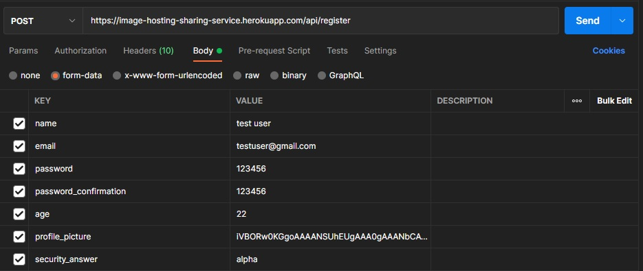

###### Response

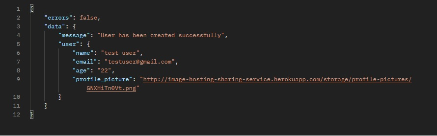
---------------------------------------------------------------------------------------

###### • Login

URL : https://image-hosting-sharing-service.herokuapp.com/api/login

{
'email' : 'testuser@gmail.com'  
'password' : 123456  
}

Response:  
{  
"errors": false,  
"data": {  
"message": "Logged in successfully",  
"user": {  
"name": "test user",  
"email": "testuser@gmail.com",  
"age": "22"  
"profile_picture": "http://image-hosting-sharing-service.herokuapp.com/storage/profile-pictures/image-name.png"  
},  
"token": "bnasbmasdnmasbm.MDAwMCwiZGF0YSI6MX0.rOwCjuny9TLSsf9Lc
MzeSuGzGU8Yez1kzWW3jzsViA4"  
}  
}  

###### Image References

Request:

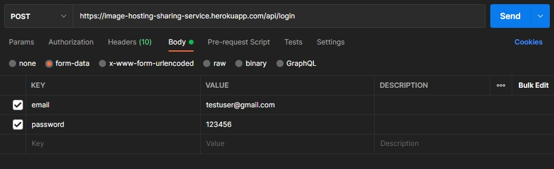

Response:

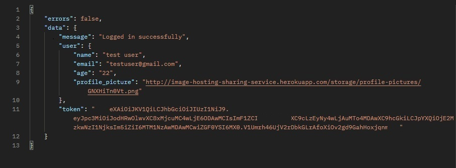
--------------------------------------------------------------------------------------

###### • Logout

Image References

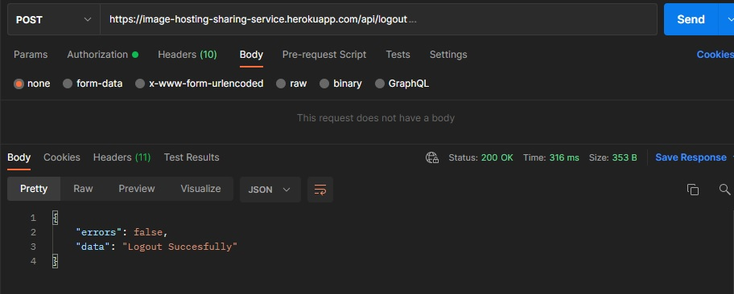
--------------------------------------------------------------------------------------

###### • Forgot Password

Image References

Request:

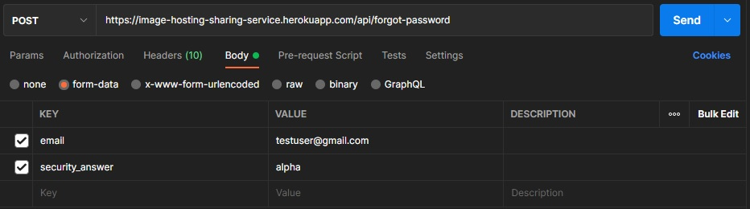

Response:

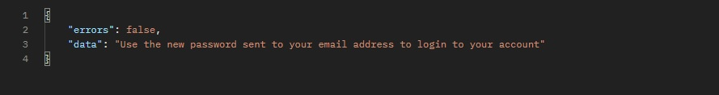
---------------------------------------------------------------------------------------

###### • My Profile

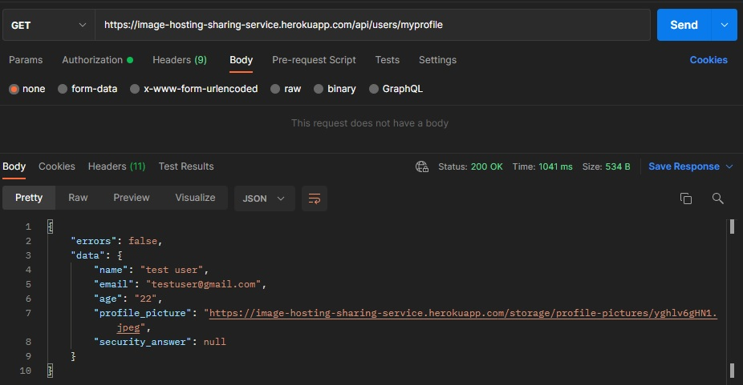

###### • Update Profile

Image References

Request: 
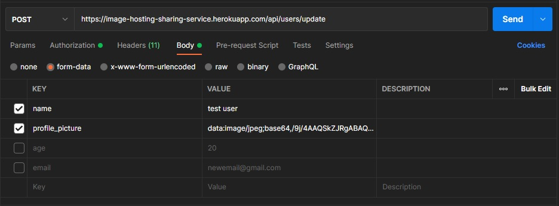

Response:

###### • Upload Images

Image References

Request:

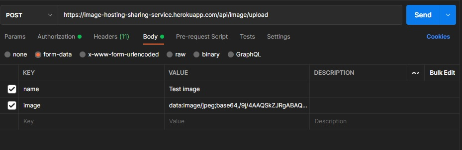

Response:

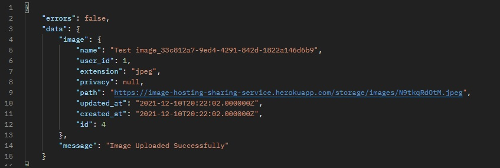
--------------------------------------------------------------------------------------

###### • Image Delete

Image References

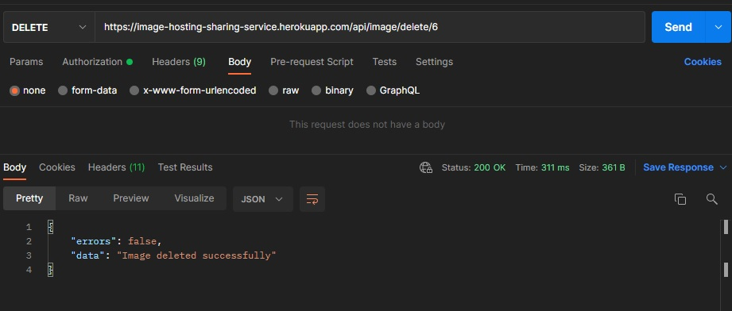
--------------------------------------------------------------------------------------

###### • All Images

Image References

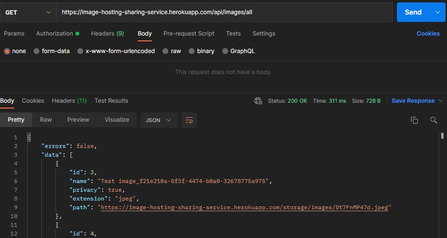
--------------------------------------------------------------------------------------

###### • All Images by the user

Image References

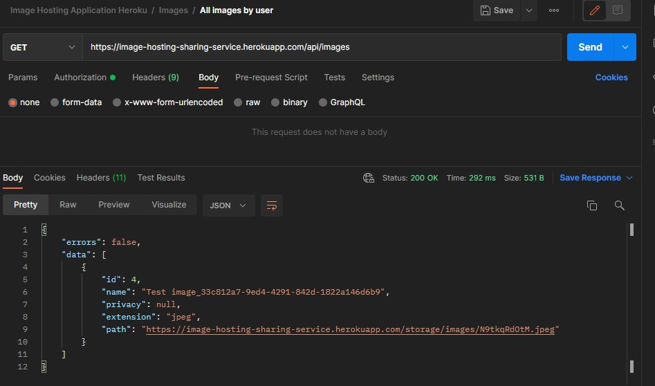
--------------------------------------------------------------------------------------

###### • Change Privacy of the image

True => Private => 1   
False => Public => 0   
NULL => Hidden

Image References

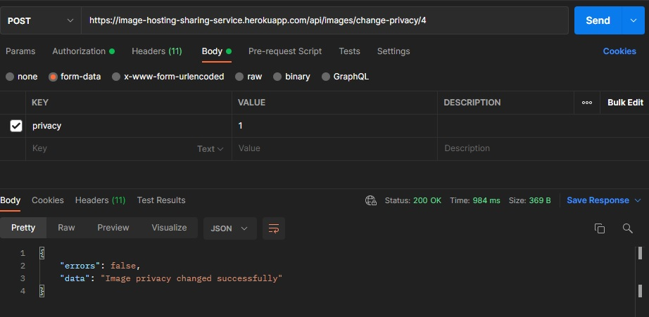
---------------------------------------------------------------------------------------

###### • Find image by id

Image References

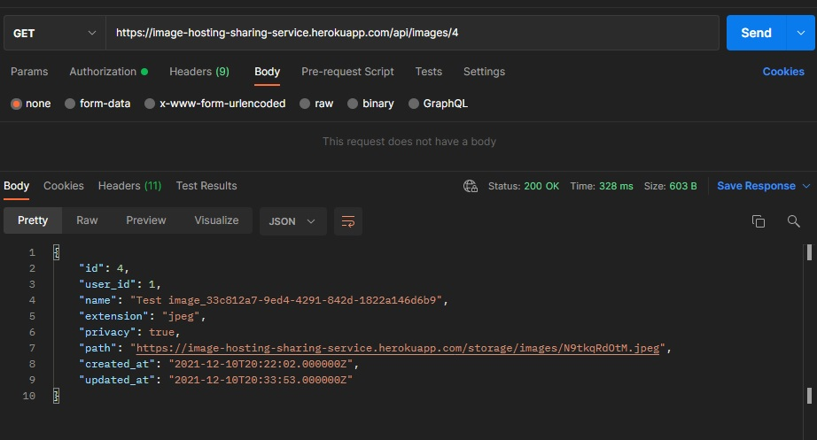
--------------------------------------------------------------------------------------

###### • Add access

Image References

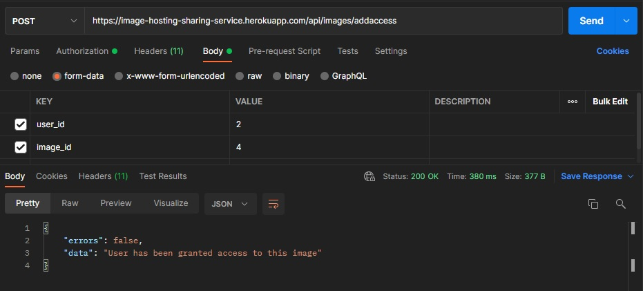
---------------------------------------------------------------------------------------

###### • Remove access

Image References

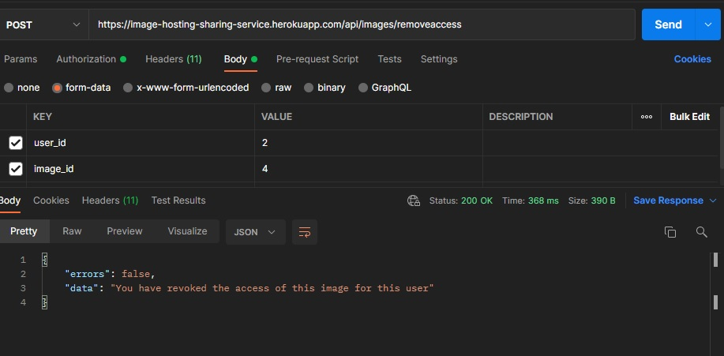